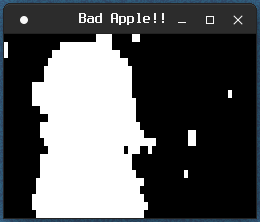

# Bad Apple X11

"Bad Apple!!" music video, but it's played by drawing tiles using pure Xlib. No sound, only video.

# Configuration

By default, configuration isn't required. However, tile size can be changed by pixels by editing first two lines in source code.
This program requries to have `xorg` and `xlib` installed to run. To compile, run `make` and `BadApple` should appear on root directory of the repository.